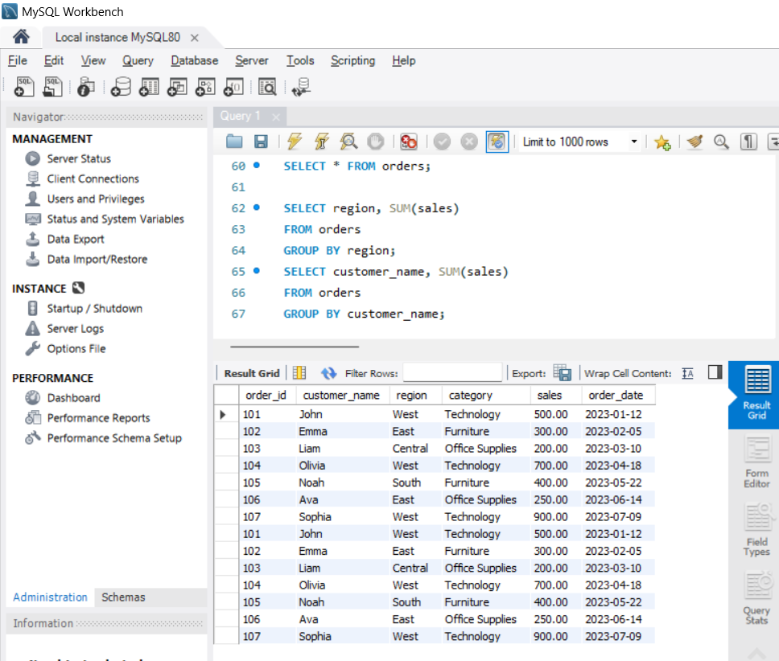

# Customer Sales Analysis using SQL

## Project Overview

This project demonstrates how SQL can be used to analyze customer sales data and extract meaningful business insights. The goal of the project is to understand sales performance across regions, identify top customers, and analyze category-wise revenue.

This project was built using **MySQL** and executed through **MySQL Workbench**.

---

## Tools Used

* SQL
* MySQL
* MySQL Workbench

---

## Dataset

The dataset contains sales order information with the following fields:

* Order ID
* Customer Name
* Region
* Product Category
* Sales Amount
* Order Date

---

## Database Setup

### Create Database

```sql
CREATE DATABASE customer_analysis;
USE customer_analysis;
```

### Create Orders Table

```sql
CREATE TABLE orders (
order_id INT,
customer_name VARCHAR(100),
region VARCHAR(50),
category VARCHAR(50),
sales DECIMAL(10,2),
order_date DATE
);
```

### Insert Sample Data

```sql
INSERT INTO orders VALUES
(101,'John','West','Technology',500,'2023-01-12'),
(102,'Emma','East','Furniture',300,'2023-02-05'),
(103,'Liam','Central','Office Supplies',200,'2023-03-10'),
(104,'Olivia','West','Technology',700,'2023-04-18'),
(105,'Noah','South','Furniture',400,'2023-05-22'),
(106,'Ava','East','Office Supplies',250,'2023-06-14'),
(107,'Sophia','West','Technology',900,'2023-07-09');
```

---

## SQL Analysis Queries

### View All Orders

```sql
SELECT * FROM orders;
```

### Total Number of Orders

```sql
SELECT COUNT(*) AS total_orders
FROM orders;
```

### Total Revenue

```sql
SELECT SUM(sales) AS total_sales
FROM orders;
```

### Average Order Value

```sql
SELECT AVG(sales) AS average_sales
FROM orders;
```

### Highest Order Value

```sql
SELECT MAX(sales) AS highest_order
FROM orders;
```

### Lowest Order Value

```sql
SELECT MIN(sales) AS lowest_order
FROM orders;
```

### Sales by Region

```sql
SELECT region, SUM(sales) AS total_sales
FROM orders
GROUP BY region;
```

### Orders by Region

```sql
SELECT region, COUNT(order_id) AS total_orders
FROM orders
GROUP BY region;
```

### Sales by Category

```sql
SELECT category, SUM(sales) AS total_sales
FROM orders
GROUP BY category
ORDER BY total_sales DESC;
```

### Top Customers

```sql
SELECT customer_name, SUM(sales) AS total_spent
FROM orders
GROUP BY customer_name
ORDER BY total_spent DESC;
```

### Top 3 Customers

```sql
SELECT customer_name, SUM(sales) AS total_spent
FROM orders
GROUP BY customer_name
ORDER BY total_spent DESC
LIMIT 3;
```

### Monthly Revenue Trend

```sql
SELECT MONTH(order_date) AS month, SUM(sales) AS revenue
FROM orders
GROUP BY month
ORDER BY month;
```

### High Value Orders (>500)

```sql
SELECT *
FROM orders
WHERE sales > 500;
```

### Orders from West Region

```sql
SELECT *
FROM orders
WHERE region = 'West';
```

---

## Key Insights

* The **West region generated the highest sales revenue**.
* The **Technology category contributed the largest share of sales**.
* A small group of customers accounted for the **highest spending**.
* Sales trends can be analyzed by month to understand seasonal patterns.

---

## Project Structure

```
customer-sales-analysis-sql
│
├── dataset.sql
├── analysis_queries.sql
├── sql-query-results.png
└── README.md
```

---

## Sample Query Result



---

## Author

Vishal Raj

GitHub:
https://github.com/vishal-raj-k

